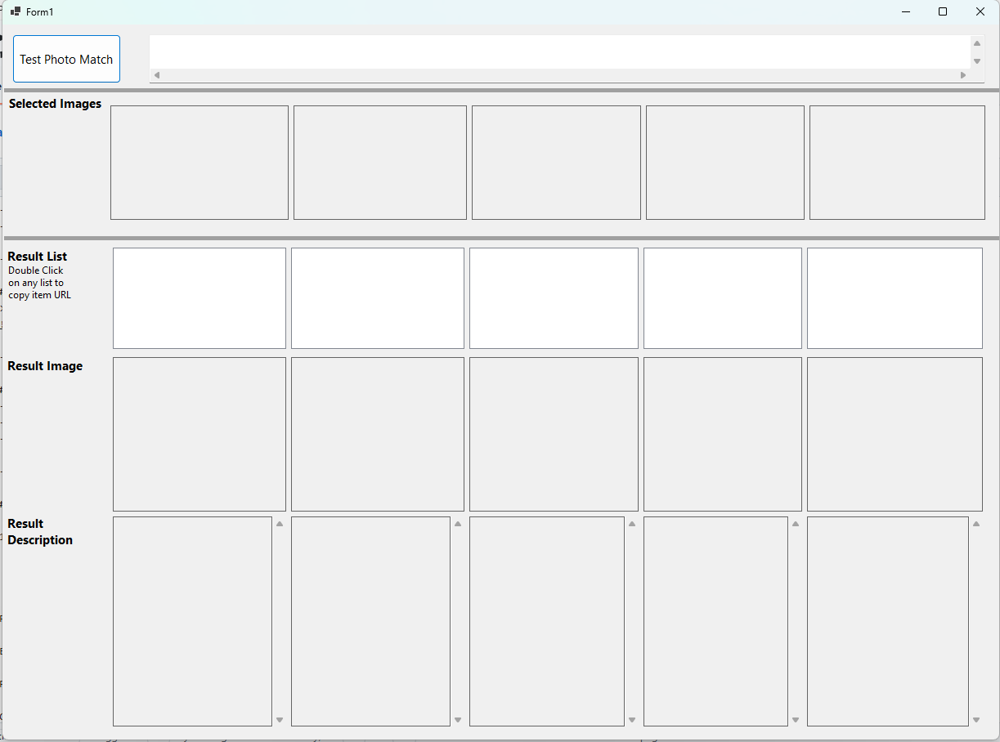

# Ebay-Image-search-app
This app helps users search ebay listing by images and gets reference links for the items helps for faster or bulk listing items on ebay 
# eBay Photo Match Tester (WinForms, C#)

A small Windows Forms app to speed up eBay listing prep:
- Select **up to 5 images** from disk.
- For each image, fetch **top matches** from eBay’s Browse API `search_by_image`.
- See: your **source photo**, the **matched eBay photo**, and a **list** with Title · Price · Description · URL.
- Double-click a list item to **copy the URL** (no browser pop-up).  
- Click once to preview the matched photo and details.

---

## Screenshots
> (Add yours later—see “Adding images” below.)


---

## Requirements
- Windows 10/11, **.NET 8** SDK
- Visual Studio 2022 (Desktop development with .NET workload)
- eBay developer account + **Production** keyset (App ID/Client ID + Client Secret) with **Browse API** access (scopes for application token)

---

## Quick start

1. **Clone**
   ```bash
   git clone https://github.com/<you>/ebay-photo-match-test.git
   cd ebay-photo-match-test

Requirements:

Ebay Dev account

Prodution Keys

Client ID

Secret ID

Replace them both in Form1.cs
